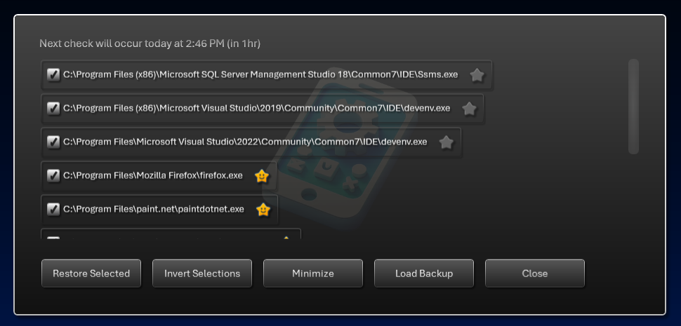

# AppRestorer - WPF

## v1.0.0.0 - August, 2025
**Dependencies**

| Assembly | Version |
| ---- | ---- |
| .NET | 8.0 |

- A [WPF](https://learn.microsoft.com/en-us/dotnet/desktop/wpf) application that records common user applications and can restore/launch them on startup.
- Applications that are detected in common Windows startup locations will be ignored.
- If any app is designated as a `Favorite` then it will be remembered even if it's not detected during runtime.

