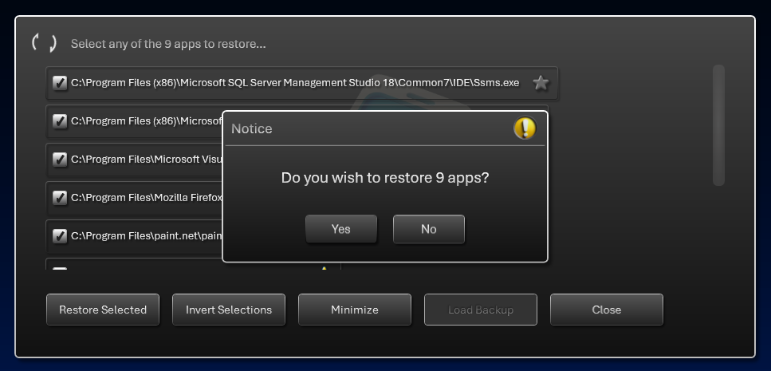

# AppRestorer - WPF

## v1.0.0.0 - September, 2025
**Dependencies**

| Assembly | Version |
| ---- | ---- |
| .NET | 8.0 |

- A [WPF](https://learn.microsoft.com/en-us/dotnet/desktop/wpf) application that records common user applications and can restore/launch them on startup.
- Applications that are detected in common Windows startup locations will be ignored.
- If any app is designated as a `Favorite` then it will be remembered even if it's not detected during runtime.
- I've included additional support extensions in this app to show how custom controls and P/Invokes can be applied without the need for 3rd party libraries.




## Revamped look


## Spinner Control

- The re-usable spiner control has many modes for rendering shapes.

```
public enum SpinnerRenderShape
{
    Dots,      // for standard/classic spinner
    Worm,      // for wiggle worm animation
    Spiral,    // for spiral rotation animation
    Polys,     // for spinner with more complex shapes
    Snow,      // for raining/snowing animation
    Wind,      // for horizontal animation
    Wave,      // for sine wave animation
    Space,     // for starfield animation
    Line,      // for line warp animation
    Stripe,    // for exaggerated line animation
    Bounce,    // for dot bouncing animation
    Square,    // for walking square animation
    Rings,     // for concentric ring animation
    Pulse,     // for ring pulse animation
    Twinkle,   // for twinkling star animation
    Meteor1,   // for shooting star animation
    Meteor2,   // for shooting star animation (with enhanced color palette)
}
```

>  Meteor2 mode (example)


## ToDo

- Explore possible tray icon addition using [wpf-notifyicon](https://github.com/hardcodet/wpf-notifyicon)